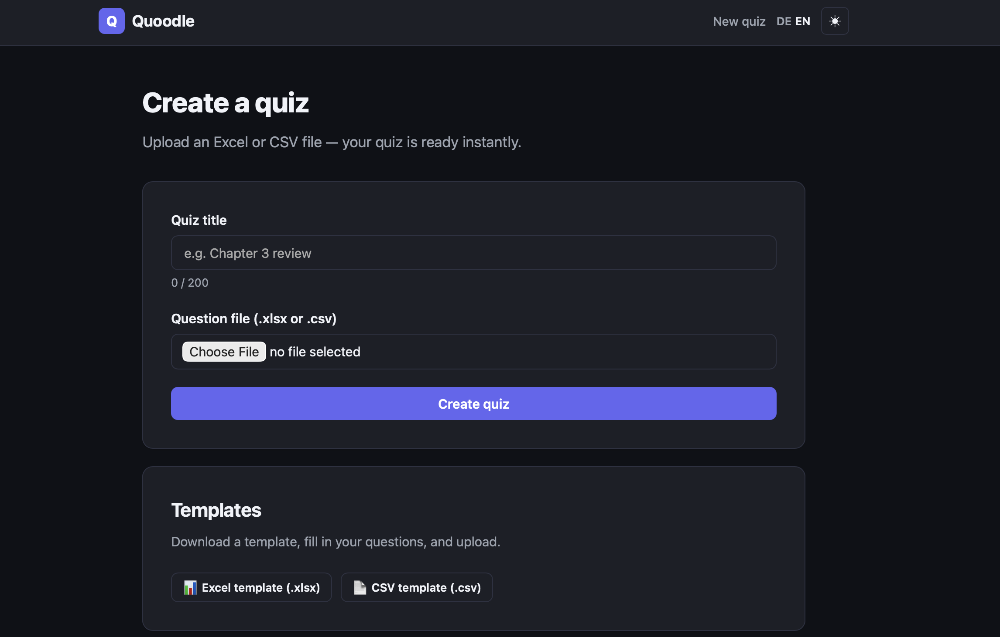
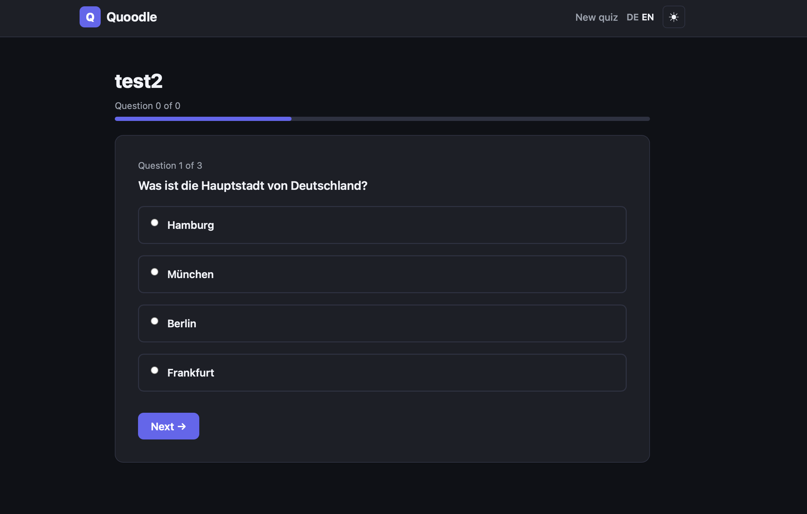
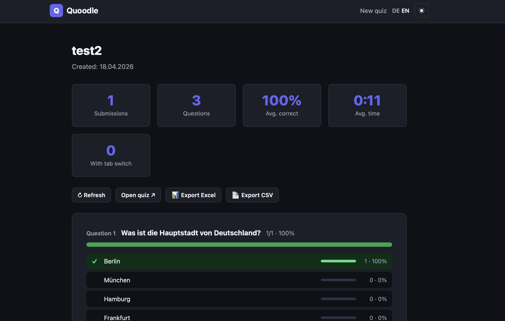

<!--
  Replace gerhi/quoodle throughout this file with your actual GitHub path.
  Replace screenshots/quoodle-*.png with real screenshots once you have them.
-->

[](https://github.com/gerhi/quoodle/stargazers)
[](https://github.com/gerhi/quoodle/network/members)
[](https://github.com/gerhi/quoodle/issues)
[](LICENSE)
[](https://www.php.net/)
[](https://www.sqlite.org/)
[](#privacy)

<h1 align="center">Quoodle</h1>

<p align="center">
  The privacy-first, zero-configuration quiz tool for teachers.<br>
  <br>
  <a href="#quick-start"><strong>Quick start »</strong></a>
  <br>
  <br>
  <a href="#features">Features</a>
  ·
  <a href="#self-host">Self-host</a>
  ·
  <a href="#privacy">Privacy</a>
  ·
  <a href="#development">Development</a>
</p>

---

## About Quoodle

Quoodle is a minimalist quiz-distribution tool for educators. A teacher uploads
a spreadsheet of questions, Quoodle turns it into a sharable link and QR code,
students take the quiz on any device, and the teacher gets aggregated statistics
back — all without a single student account, a single tracking cookie, or a
single byte of personally identifiable data being stored.

It runs on **plain PHP 8 and SQLite**, fits in 30 files, and is designed to be
deployed to the cheapest shared hosting you can find. There is no build step,
no Node, no Docker, no external services.

<br>

<p align="center">
  
  
  
</p>

---

## Features

### For teachers

- 📤 **Upload XLSX or CSV** — one row per question, 1–5 distractors, optional explanation.
- 🔗 **Two links per quiz** — a public student link and a private teacher link, each with its own QR code.
- 📊 **Aggregated statistics** — per-question success rate, per-choice distribution, average time, tab-switch rate.
- 📥 **Excel and CSV export** — three sheets, bold headers, German/English labels.
- 🔑 **No account required** — knowledge of the teacher token _is_ the authorization.

### For students

- 🎯 **Immediate feedback** — every answer is marked correct or wrong the moment it is clicked.
- ⏱ **5-second lockout on wrong answers** — nudges learners to read the explanation.
- 🔀 **Shuffled answer order** — sharing "A, C, B, D" is useless; order is different every load.
- 📱 **Works on any phone** — mobile-first, 320 px minimum width, no app install.
- 🌙 **Dark mode** — preference stored in a cookie, no flash of light theme on load.

### For everyone

- 🇩🇪🇬🇧 **German and English UI** — full `Accept-Language` detection, switchable any time.
- 🔒 **No external requests** — no CDN fonts, no Google, no Sentry, no analytics.
- 🗄 **No student database** — not even a session cookie is set for learners.

---

## Why Quoodle

If you have ever tried to run a short knowledge check in class, you have
probably noticed that every existing tool wants something: an account, a
school-wide license, a download, a tracking banner, or a cloud service in a
jurisdiction your data-protection officer dislikes.

Quoodle is the opposite. One teacher. One file. One shared hosting account.
Three hundred learners on their phones. No receipts filed anywhere.

It is intentionally **not a Kahoot competitor**: there is no synchronous lobby,
no buzzer, no scoreboard. If you want live, real-time quizzes, use
[ClassQuiz](https://github.com/mawoka-myblock/ClassQuiz) or similar. Quoodle is
for the asynchronous case — a homework check, a concept review, a self-test
that students take in their own time.

---

## Quick start

### Requirements

- PHP **8.0 or newer** with the following extensions:
  - `pdo_sqlite` — for the embedded database
  - `zip` — for parsing XLSX uploads and building XLSX exports
  - `simplexml`, `mbstring` — standard on every PHP install
- Any **Apache** shared host with `.htaccess` support, or Nginx with
  equivalent deny rules for `lib/`, `lang/`, `data/`, `templates/`.
- ~5 MB of disk space.

That's it. No database server, no Redis, no build tools, no Composer.

### Installation

1. Download the [latest release ZIP](https://github.com/gerhi/quoodle/releases)
   or clone the repo.
2. Upload the contents of the `quoodle/` folder to your web root (or a
   subdirectory).
3. Make the `data/` folder writable by the PHP process:
   ```
   chmod 750 data/
   ```
4. Open the site in your browser. The SQLite database is created on the first
   request.

If the page stays blank, open `diagnose.php` in the browser — it prints a full
environment check (PHP version, extensions, file permissions). **Delete the
file afterwards**, it exposes server paths.

### Usage

1. Download the XLSX or CSV template from the landing page.
2. Fill in your questions:

   | Column | Content                                          |
   |--------|--------------------------------------------------|
   | A      | Question text                                    |
   | B      | Correct answer                                   |
   | C–E    | 1–3 distractors (more allowed, up to column F–1) |
   | Last   | Optional explanation                             |

3. Upload the file. Quoodle shows you two links:
   - **Student link** → share with your class (QR or URL).
   - **Teacher link** → keep private, shows aggregated results.

---

## Privacy

The privacy posture is not a marketing claim — it is baked into the
architecture. Specifically:

| What is stored                                   | What is **not** stored       |
|--------------------------------------------------|------------------------------|
| Anonymous counters per quiz (attempts, per-question correctness, per-choice frequency) | IP addresses                 |
| Total elapsed time across all submissions        | User-Agent strings           |
| Total tab-switch count across all submissions    | Session IDs                  |
| Number of submissions with at least one tab-switch | Individual submission records |
|                                                  | Per-student answers          |
|                                                  | Timestamps of individual submissions |
|                                                  | Anything resembling a name, email, or device fingerprint |

Two cookies are used, both non-tracking:

- `lang` — stores the user's language choice (`de` or `en`), 1 year max-age.
- `theme` — stores the user's theme choice (`light` or `dark`), 1 year max-age.

No third-party services are contacted during normal operation. QR codes are
generated server-side in PHP. Fonts are the user's system fonts. There is no
CDN. There are no analytics.

The GDPR-boilerplate pages (`impressum.php`, `datenschutz.php`) ship in German
only, because they address German legal requirements; they contain clearly
marked placeholders for operator contact details.

---

## Self-host

See [Quick start](#quick-start). There is nothing else.

If your shared host is PHP 8.1 or newer and you have `pdo_sqlite` and `zip`
enabled (they are defaults on most hosts), you are ready. If you run into
problems, the bundled `diagnose.php` will tell you which prerequisite is
missing.

---

## Development

### Structure

```
quoodle/
├── .htaccess                # Apache rules: deny lib/, lang/, data/, templates/
├── index.php                # Landing + template download
├── upload.php               # POST: validate upload, parse file, create quiz
├── share.php                # Teacher share page (QR codes, copy buttons)
├── quiz.php                 # Student stepper
├── submit.php               # POST: grade + render feedback
├── stats.php                # Teacher analytics
├── export.php               # XLSX / CSV download
├── impressum.php, datenschutz.php  # German legal pages
├── layout.php               # Shared header/footer renderer
├── assets/
│   ├── style.css            # Design system, light + dark
│   └── app.js               # Stepper, copy, theme toggle, timer, tab-switch
├── lib/
│   ├── helpers.php          # escape, IDs, tokens, validation, formatting
│   ├── i18n.php             # language cascade, t(), tp()
│   ├── db.php               # SQLite PDO + retry-with-backoff submission recorder
│   ├── qr.php               # self-contained QR code generator (SVG, pure PHP)
│   ├── xlsx_parser.php      # ZipArchive + SimpleXML reader
│   ├── csv_parser.php       # RFC 4180 reader with auto-delimiter detection
│   └── xlsx_writer.php      # ZipArchive + XML writer (no external dependency)
├── lang/
│   ├── de.php               # German strings
│   └── en.php               # English strings
├── data/                    # SQLite file lives here (writable)
├── templates/               # downloadable question templates
└── docs/                    # design docs, requirements, addenda
```

### Tech stack

| Layer        | Choice                                                        |
|--------------|---------------------------------------------------------------|
| Runtime      | PHP 8.0+                                                      |
| Storage      | SQLite in WAL mode, single file in `data/quoodle.db`          |
| Concurrency  | `BEGIN IMMEDIATE` transactions with exponential-backoff retry |
| Frontend     | Vanilla JS + CSS custom properties (no framework, no build)   |
| QR           | Reed-Solomon + mask evaluation in pure PHP, ~400 LoC          |
| XLSX         | Raw ZIP + XML via `ZipArchive`, ~450 LoC                      |
| i18n         | `t()` / `tp()`, pipe-separated plurals in language files      |

### Adding a language

1. Copy `lang/de.php` to `lang/xx.php`, translate the strings.
2. Add `xx` to `QUOODLE_LANGS` in `lib/i18n.php`.
3. Add a language switcher entry in `layout.php`.

That's the entire process. No build, no rebuild, no JSON manifest.

### Requirements document

The full functional, security, and privacy requirements are in
[`docs/quoodle-requirements.md`](docs/quoodle-requirements.md).
The v1.1 additions (immediate feedback, time tracking, tab-switch detection,
aggregation) are in
[`docs/requirements-addendum-v1.1.md`](docs/requirements-addendum-v1.1.md).

---

## What Quoodle is not

- It is **not a Kahoot / ClassQuiz replacement**. There is no synchronous
  lobby, no live buzzer, no scoreboard.
- It is **not a testing platform**. Correct answers are available to the
  browser for immediate feedback — a motivated learner can open DevTools and
  see them. This is a deliberate trade-off: Quoodle is a self-test tool, not
  an examination system.
- It is **not a replacement for your LMS**. There are no courses, no
  gradebooks, no user accounts.

If any of those disqualify it for you, that is the correct conclusion.

---

## Acknowledgements

The design goals (privacy by construction, zero accounts, shared-hosting
deployability) are inspired by the small-tool aesthetic of projects like
[ClassQuiz](https://github.com/mawoka-myblock/ClassQuiz) and the general
"[build tools for teachers, not platforms](https://en.wikipedia.org/wiki/Small_is_Beautiful)" movement.

Parts of this codebase were developed with the assistance of Anthropic's Claude.

---

## License

Released under the [MIT License](LICENSE).

If you build on Quoodle, please keep the privacy guarantees intact — the whole
point of the project is that students can trust the URL they click on.
