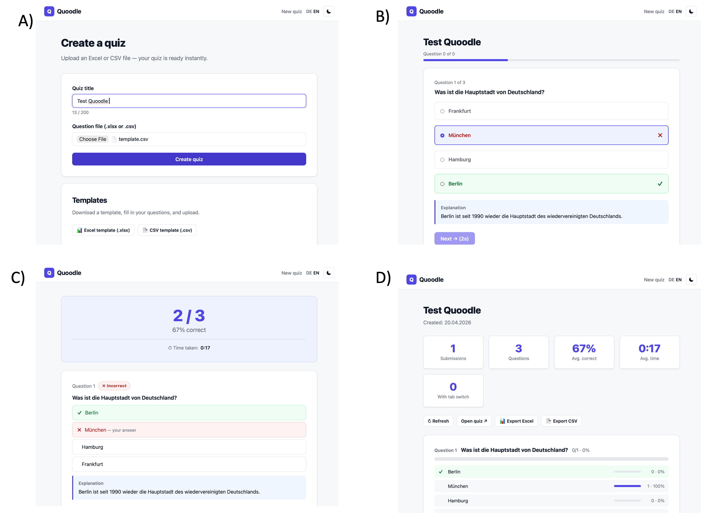

# Summary

`Quoodle` is a minimalist, self-contained web application for creating and distributing multiple-choice knowledge checks in educational settings. The workflow is familiar to anyone who used a doodle.com to schedule a meeting (see fig. 1 below). A teacher uploads a spreadsheet of questions; quoodle returns a shareable URL and QR code for learners, along with a separate URL through which the teacher can view aggregated results. Learners can answer the quiz on any device, receive immediate per-question feedback with an explanation, and see their score and basic information on upon completion. The teacher sees class-level statistics — success rates per question, distribution of selected distractors, average completion time, and a tab-switching indicator — but no individual submission records.

# Statement of need

Formative assessment through short knowledge checks is a well-established classroom practice that is highly efficient in improving student learning [@Hattie2007]. However, in Germany less than 20% of university students report receiving regular feedback [@Multrus2017Studi-47447]. Many tools exist to close this gap from proprietary platforms such as Kahoot! and Quizlet to open-source alternatives like ClassQuiz [@classquiz]. Existing tools, however, impose one or more barriers to their wide-spread adoption of quizzes to support student learning.

1. **Student accounts.** Most platforms require learners to create an account or join a session identified by a persistent pseudonym.
2. **Third-party data processing.** Hosted platforms typically process student interaction data on servers outside the educator's legal jurisdiction, creating friction with the EU General Data Protection Regulation [@gdpr] and regional school-data-protection directives.
3. **Infrastructure complexity.** Open-source alternatives often require Docker, a separate database server, a message broker, and a reverse proxy — a barrier for individual teachers, small schools, and resource-constrained institutions.
4. **Tracking and telemetry.** Even where not strictly required, many tools contact analytics services, CDNs, or sentry endpoints on every page load, surfacing data outside the trust boundary the learner expects.
4. **Correctness-only feedback without explanations.** Most existing tools are not designed to foster self-regulated learning only provide feedback on the correctness or incorrectness of the responses without offering explanations.

`Quoodle` addresses these barriers by focusing on a very limited application scenario rather than by configuration. Even for those teachers with access to learning-management systems, quoodle is faster, easier and simpler than most LMS-based tools that do not allow the import of existing multiple-choice tests. 

- **No student or teacher accounts.** A quoodle is a transient activity to improve self-regulated learning. Learners access the quiz through a URL and are neither asked for a name nor tracked across sessions.
- **No personally identifiable data is ever stored.** The database contains only aggregate counters — the number of submissions per quiz, how often each question was answered correctly, and how often each answer option was selected. Individual submissions are not persisted.
- **Spreadsheet based Multiple-Choice Tests** Even though complex specifications for tests have been proposed and implemented in LMS [https://docs.moodle.org/501/en/Import_questions] these have a steep learning curve for teachers who prefer simple spreadsheet-based methods to store and share multiple-choice tests.
- **No external network requests.** All assets (stylesheets, scripts, fonts, QR codes) are served from the same origin as the application. QR codes are generated server-side in PHP, eliminating dependence on external QR services.
- **Minimal hosting requirements.** The only requirements for the hosting are PHP 8 with the `pdo_sqlite` and `zip` extensions — both present by default on essentially every commercial hosting provider. No database server, no container runtime, no build tooling, and no Node.js is needed.

`Quoodle` is intentionally limited to asynchronous, self-paced knowledge checks. It does not offer live, synchronous quiz sessions with scoreboards for individual learners; educators seeking that functionality are better served by tools such as ClassQuiz [@classquiz] or comparable live-quiz platforms.

# Pedagogical design

The student-facing interface implements immediate formative feedback, a practice with substantial support in the educational literature [@Hattie2007]. Furthermore, how students perceive of the assessment matters to their outcome [@Brown2009]. When a learner selects an answer:

- The correct answer is highlighted in green and the selected answer, if different, in red.
- Any explanation provided by the educator (an optional spreadsheet column) is revealed inline.
- After a correct selection, the learner may advance immediately.
- After an incorrect selection, the "next" button is disabled for five seconds, forcing the learner to engage with the explanation before moving on. This follows the retrieval-practice-with-feedback design principle [@roediger2011] that immediate, elaborative feedback on incorrect responses produces larger learning gains than delayed or correctness-only feedback.

For educators, the statistics dashboard surfaces three categories of insight. These are signals for the educator, not surveillance of individuals; the underlying per-submission values are never persisted. 

1. **Overall performance and engagement** - The number of learners who took the test, the average number of correct responses, the average time on task and the average number of tab-switches.
2. **Individual question difficulty** — The percentage of learners who answered each question correctly, color-coded for rapid scanning (green ≥ 75%, amber 50–74%, red < 50%).
3. **Individual distractor analysis** — how often each wrong option was selected, useful for identifying misconceptions that a particular distractor captures.

# Implementation

`Quoodle` consists of approximately 30 files organised into page-level scripts (`index.php`, `upload.php`, `quiz.php`, `submit.php`, `share.php`,`stats.php`, `export.php`), a library directory (SQLite access, QR code generator, XLSX reader and writer, internationalisation), and a lightweight JavaScript/CSS front-end with no build step and no framework dependency.

The QR-code generator implements the full ISO/IEC 18004 encoding pipeline [@iso18004]. The XLSX reader and writer use PHP's built-in `ZipArchive` and `SimpleXML` extensions to parse and produce Office Open XML documents directly, without any external library. The writer supports multiple sheets, bold header rows, and shared-string deduplication.

Concurrent submissions are handled via SQLite's Write-Ahead Logging journal mode and `BEGIN IMMEDIATE` transactions, with an exponential-backoff retry loop bounded at ten attempts. Submissions that fail to record (e.g. on sustained lock contention) do not block the learner's feedback page — a deliberate trade-off that favours learner experience over perfect aggregation consistency in pathological cases. 

The source code is availible at [https://github.com/gerhi/quoodle](https://github.com/gerhi/quoodle). A hosted version can be accessed at [http://www.gerrithirschfeld.de/quoodle](http://www.gerrithirschfeld.de/quoodle).

# Acknowledgements

We acknowledge the design influence of ClassQuiz [@classquiz] in shaping the scope and pedagogy of the student-facing flow. Large parts of the codebase were drafted with the assistance of Anthropic's Claude, under human design direction, review and verification.

# References
